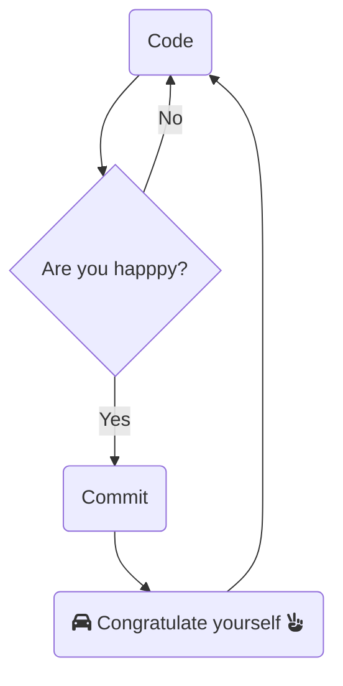

# Who am I ?

​
Hi ! My name is Alexandre, I live in Hyères in the south of France, under the palm trees 🌴 listening to the sweet song of the cicadas 🎵 . Sea 🌊 , dev 💻  and sun ☀️

I'm starting to use github to show my work.   
​
One day, a great philosopher told me: "When you are happy, commit!"

## Languages and Tools 

<table>
    <thead>
        <tr>
            <th colspan="2">Languages and Tools </th>
        </tr>
    </thead>
    <tbody>
        <tr>
            <td>Industrial automation</td>
            <td>
              
            </td>
        </tr>
        <tr>
          <td>Statistical and mathematical computing</td>
          <td>
            
            
          </td>
        </tr>
        <tr>
          <td>Web development (front-end)</td>
          <td>
            
            
            
          </td>
        </tr>
        <tr>
          <td>Web development (back-end)</td>
          <td>
            
            
            
            
          </td>
        </tr> 
        <tr>
          <td>Database</td>
          <td>
            
            
          </td>
        </tr>
        <tr>
          <td>Versioning</td>
          <td>
            
            
            
          </td>
        </tr>
        <tr>
          <td>Test</td>
          <td>
            
          </td>
        </tr>
        <tr>
          <td>IDE</td>
          <td>
            
          </td>
          <tr>
          <td>OS</td>
          <td>
            
            
          </td>
        </tr>
        </tr>
    </tbody>
</table>

## Contact

